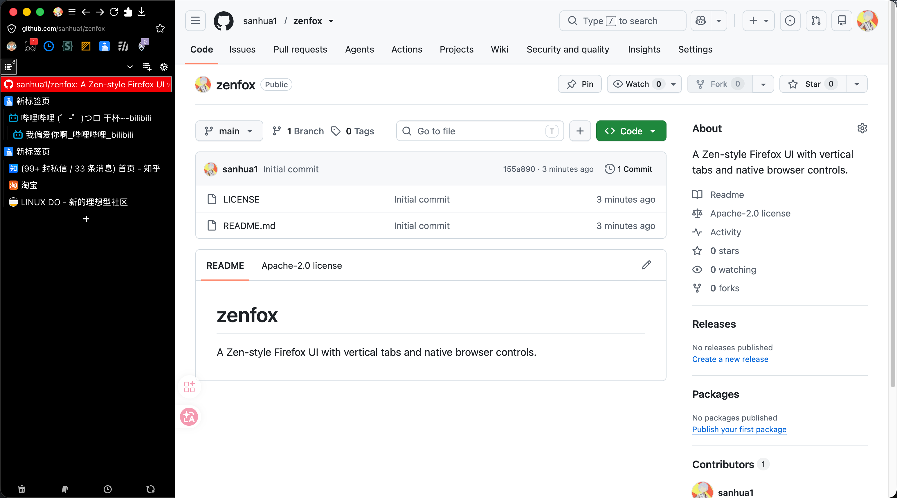

# Zenfox

[English](README.md) | [简体中文](README.zh-CN.md)

一套受 Zen Browser 启发、结合 Sidebery 树状标签页与 Firefox 原生控件的界面方案。

## 为什么会有 Zenfox？

Zen Browser 将浏览器控件集中在左上角，不再让横向工具栏长期占据整个窗口顶部。当顶部和底部都没有额外的常驻 UI 时，网页可以获得尽可能大的显示空间，这种设计是 Zenfox 最初的灵感来源。

我此前使用过一套自定义 Firefox，通过 `userChrome.css` 自动隐藏和显示顶部工具栏。它能够工作，但工具栏出现时存在轻微延迟，频繁的显示与隐藏也不如把所有控件固定在一个紧凑角落里方便。

我也尝试过转向 Zen Browser，但我非常依赖 Sidebery 及其树状标签页。Zen 自带的侧边栏无法与 Sidebery 配合，也不能提供相同的树状标签工作流，因此它并不适合替代我现有的 Firefox 使用方式。

Zenfox 选择保留 Firefox 与 Sidebery，并重新排列 Firefox 的原生 UI。它把导航按钮、地址栏、下载和扩展控件集中到 Sidebery 上方的左上角区域，在保留原生浏览器功能的同时，移除占据整个窗口宽度的顶部栏。



Zenfox 是一个独立的自定义项目，与 Zen Browser、Mozilla 或 Sidebery 没有关联。

## 安装前提

1. 安装 Firefox，并至少启动一次，让 Firefox 创建 Profile。
2. 安装 [Sidebery](https://addons.mozilla.org/firefox/addon/sidebery/)。
3. 当安装脚本提示时关闭 Firefox。

安装脚本会先检测 Firefox、当前使用的 Profile 和 Sidebery，之后才会修改文件。原有的 Zenfox/userChrome 文件会备份到：

```text
<Profile>/zenfox-backups/<时间戳>/
```

> 兼容状态：当前 UI 已在 macOS 与 Firefox 152 上完成测试。Windows 和 Linux 的安装、检测流程已经实现，但两个平台的原生窗口按钮和最终布局仍需进行真机视觉验收。

## 一行命令安装

### Windows 10/11

打开系统自带的 **PowerShell** 或 **Windows Terminal**，运行：

```powershell
$p=Join-Path $env:TEMP 'zenfox-install.ps1'; $u='https://raw.githubusercontent.com/sanhua1/zenfox/main/install-windows.ps1?cb='+[guid]::NewGuid().ToString('N'); Invoke-WebRequest -UseBasicParsing -Headers @{'Cache-Control'='no-cache'} -Uri $u -OutFile $p; powershell.exe -NoProfile -ExecutionPolicy Bypass -File $p
```

不需要安装 PowerShell 7、Git、Python 或 Node.js。当 Zenfox 向 Firefox 程序目录写入 fx-autoconfig 的两个启动文件时，Windows 可能会显示一次 UAC 授权窗口。

### macOS

```bash
curl -fsSL -H 'Cache-Control: no-cache' "https://raw.githubusercontent.com/sanhua1/zenfox/main/install-macos.sh?cb=$(date +%s)-$$" | bash
```

### Linux

```bash
curl -fsSL -H 'Cache-Control: no-cache' "https://raw.githubusercontent.com/sanhua1/zenfox/main/install-linux.sh?cb=$(date +%s)-$$" | bash
```

Linux 支持原生软件包或 Mozilla 压缩包版本的 Firefox。Snap 和 Flatpak 版本的程序目录受到沙盒或只读限制，因此暂不支持。

安装脚本可以检测 Sidebery，但不能修改 Sidebery 扩展内部的私有设置。可选的配套 CSS 需要手动粘贴到 Sidebery 的样式编辑器中。

浏览器启动时，Zenfox 会关闭 Firefox 独立的原生侧边栏启动器，并将 Sidebery 选为当前侧边栏，避免新的 Firefox Profile 同时显示原生启动器和 Sidebery 面板。

## 仅检测环境

从克隆到本地的仓库中，可以只检查前提条件，不写入任何文件：

```bash
./install-macos.sh --check
./install-linux.sh --check
```

```powershell
.\install-windows.ps1 -CheckOnly
```

如果明确希望在没有 Sidebery 的情况下继续，macOS/Linux 可添加 `--allow-missing-sidebery`，Windows 可添加 `-AllowMissingSidebery`。

## 安装内容

```text
Firefox 程序目录
├── config.js
└── defaults/pref/config-prefs.js

Firefox Profile
├── user.js                         # 开启 userChrome 与 userChromeJS
└── chrome/
    ├── userChrome.css
    ├── platform-windows-linux.css   # Windows/Linux 紧凑窗口按钮
    ├── sidebery-companion.css      # 可选：粘贴到 Sidebery 样式编辑器
    ├── JS/LeftChrome.uc.js
    └── utils/                      # fx-autoconfig 运行组件
```

Firefox 更新可能覆盖程序目录里的两个启动文件。重新运行安装命令即可修复，并且修复前仍会创建一份新的备份。

## 更新与修复

更新或修复 Zenfox 时，重新运行同一条一行安装命令即可。每次运行都会重新检测 Firefox、当前 Profile 与 Sidebery，创建新的时间戳备份，然后安装仓库中的最新 Payload。

对于维护者：

- 通用 UI 样式更新放在 `payload/profile/chrome/userChrome.css`，Windows/Linux 窗口按钮布局放在 `payload/profile/chrome/platform-windows-linux.css`。
- 浏览器结构与行为更新放在 `payload/profile/chrome/JS/LeftChrome.uc.js`。
- fx-autoconfig 更新放在 `payload/profile/chrome/utils/` 和 `payload/firefox/`。
- 安装行为分别由三个平台的安装脚本维护。
- 发布新的 Zenfox 版本时同步更新 `VERSION`。

默认安装命令跟随 `main` 分支。稳定版本可以将 `ZENFOX_REF` 固定到经过测试的 tag，从而分别维护开发通道和稳定发布通道。

## 高级路径覆盖

只有一个 Firefox Profile 正在运行时，脚本会优先选择该 Profile；否则回退到当前 Firefox 安装指定的默认 Profile。以下环境变量可以覆盖自动检测：

```text
ZENFOX_PROFILE
ZENFOX_REF
ZENFOX_REPO
ZENFOX_FIREFOX_APP     # macOS
ZENFOX_FIREFOX_ROOT   # Windows/Linux
```

## 安全说明

`fx-autoconfig` 会执行拥有浏览器界面内部权限的代码。运行前请检查脚本，并且只从可信来源安装 Zenfox。Windows 命令中的 `-ExecutionPolicy Bypass` 只对本次 PowerShell 进程生效，不会永久修改系统的脚本执行策略。

项目所包含的第三方代码及许可信息请参阅 [THIRD_PARTY_NOTICES.md](THIRD_PARTY_NOTICES.md)。
